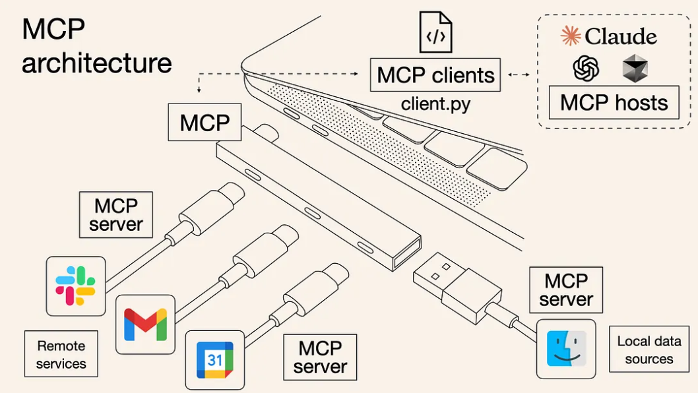
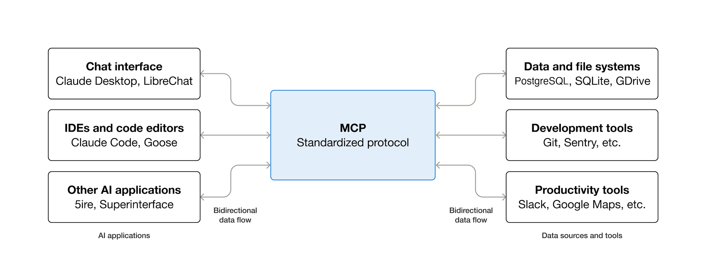
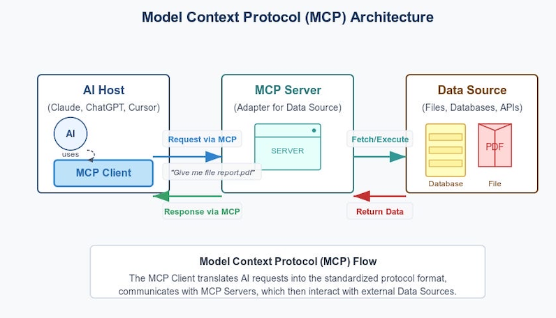

# Week 08: Model Context Protocol (MCP) - Instructor Notes

# 1. Origins & driving forces

### The “why” behind MCP
- Prior to MCP, many large language models (LLMs) or AI-assistants could only operate against static training data or isolated tools. When you wanted your assistant to call a tool (e.g., “search database”, “write to repo”, “send email”) or access external data (files, DBs, cloud services), you ended up building custom integrations for each model × each tool.  
- This multiplies into an N×M problem: N models, M tools/data-sources, each pair a bespoke connector. Many articles cite this as a core motivation for MCP.  
- Also, the context management problem: LLMs switching between tools/data, losing track of what’s relevant, what state a “session” has, what user has done. Traditional “stateless API calls” weren’t sufficient.  
- Fragmentation of ecosystem: each company building proprietary tool-connectors led to lock-in, duplication, brittle systems. MCP was positioned as a standard, open‐protocol to allow multiple models/tools to interoperate.  

### Launch & coalescence
- MCP was formally introduced by Anthropic in November 2024.  
- Right after launch, there was a rapid interest because if you think of it as “USB-C port for AI apps” (their analogy) you immediately see the value: build once, plug many.  

---

# 2. Architecture & key design decisions

Let’s walk through the major architectural components of MCP and how they came about.

### a) Client-Host-Server model
- One of the foundational architecture decisions: MCP uses a host (the AI application environment), clients embedded in that host (which convert user/assistant requests into MCP protocol messages), and servers that expose resources/tools.  
- Why this model? Because you want clean separation:
  - The host holds the model (and interacts with user)
  - The client acts as the protocol bridge (so the host doesn’t have to custom-code every tool)
  - The server is the tool/data‐source interface (so ↳ every tool doesn’t need a special model integration)
- This decouples tools from models, and opens possibility for reuse, versioning, and standardization.

*The “USB hub” visual shows a single MCP client inside an AI host (Claude, ChatGPT, Cursor, etc.) fanning out to many MCP servers. Each server adapts either remote SaaS services (Slack, Gmail, Calendar) or local system resources, capturing the decoupling and plug-and-play reuse goals discussed above.*

### b) Transport & message format
- MCP uses JSON-RPC 2.0 over transports like STDIO, HTTP+SSE, etc.  
- Design implication: Using a well-known RPC format rather than inventing something completely unique means easier adoption by devs, existing libraries, and tooling.
- It also supports stateful sessions (vs purely stateless REST), which was one of the key architecture choices: you need context retention over many tool calls.  

### c) Core primitives: Resources, Tools, Prompts
- MCP defines three key kinds of “things” the model might interact with:
  - **Resources**: Read-only data, files, DBs, knowledge-bases the model can access
  - **Tools**: Actions/functions the model can invoke (can change state, write data, call APIs)
  - **Prompts**: Reusable templates of how the model should use a tool or resource
- Choosing those primitives was important: they map well to developer mental models (data vs action vs guidance) and help keep the protocol simple but expressive.

### d) Context & session management
- Another key decision: support for session context rather than purely one-off calls. That means the model+client+server can maintain state (what’s been done, what tools have been used, what data has been fetched) across a conversation or workflow.  
- This enables more advanced “agentic” behaviour: multi-step tool orchestration, where one tool call sets up for another, and context matters.

*Here MCP is depicted as the neutral protocol layer between AI applications (chat interfaces, IDEs, agent shells) and heterogeneous data/tool ecosystems (databases, developer platforms, productivity suites). The bidirectional arrows reinforce that context flows both ways—models can push actions downstream and ingest responses upstream within the same session.*

### e) Standard vs custom connector strategy
- MCP explicitly aims to allow standard connectors (servers) for common data-sources/tools (GitHub, Google Drive, SQL, etc) so developers don’t reinvent the wheel.  
- But also built to allow custom servers for proprietary systems. That duality (standard + extendable) is a key architecture trade-off: too rigid = limited; too loose = fragmentation.

### f) Security, permissions, isolation
- From the start, MCP architects had to decide how to isolate models from tools, how to authenticate tool calls, how to ensure safe stateful sessions and prevent “runaway” tool usage. While the standard itself gives premises, much of security remains implementation-side.  
- Some architecture pieces: sessions, host boundaries, client mediation, tool metadata. Servers must define schemas that clients/models respect, etc.

---

# 3. Evolution & ecosystem growth

### Early “toy” and internal integrations
- At first, MCP came as a reference protocol, SDKs, maybe sample servers for popular services (GitHub, Notion, etc). Developers experimented with building simple “connect my LLM to my files” use cases.  
- The early version emphasised simplicity, minimal viable standard: You could build a server, register tools/resources, connect a client, send JSON-RPC, get results.

### Expansion into agent flows & multi‐tool orchestration
- As devs used it, the focus shifted: not just “model calls tool once” but “model orchestrates multiple tools, carries state, dynamically chooses next tool based on result”. This required richer context/metadata support.  
- Also, the notion of “session tokens”, tool provenance, chaining results, context cleanup became important design concerns.

### Standardisation & cross-vendor adoption
- One of the big inflection points: major platforms recognising the benefit of a common protocol. This drives network effect: the more models support MCP and the more tools/servers support MCP, the stronger its value. News sources show adoption by big vendors.

### Enterprise features & production readiness
- Over time, committees and developers realised that production use needs more than simply connecting a model to a tool. Needs include: multi-tenant servers, quotas, logging, auditing, secure authentication, versioning of tools/resources, behaviour alerters, isolation of sessions, fallback handling. Some blog posts already highlight “security risks and controls” for MCP servers.  
- Also scalability: how many servers/tools can you support, what state management, what transport layer? These inform evolving best practices.

---

# 4. Key architecture decisions that shaped the protocol

Let’s call out 5 pivotal decisions in the evolution of MCP and why they matter.

1. **Choosing JSON-RPC + stateful sessions instead of purely RESTful HTTP**
   - **Why**: REST models treat each request as independent; for agentic flows you need session context, streaming notifications, multi-tool orchestration.
   - **Impact**: Enables richer client↔server interactions, maintains context, supports server-sent events.  

2. **Separation of client vs server vs host roles**
   - **Why**: To decouple responsibilities — the model host need not know each tool’s internals; the server need not embed the model.
   - **Impact**: Modules can evolve independently; you can plug different servers/tools without rewriting model code.

3. **Unified “tool/schema” registration mechanism with metadata**
   - **Why**: The model needs to know what operations exist, what parameters they accept, their outputs. Having tool metadata avoids ad-hoc tool-calls.
   - **Impact**: Easier introspection by model, safer invocation, predictable behaviour.  

4. **Support for both resources (read) and tools (action)**
   - **Why**: Many integrations are read-only (knowledge retrieval) but many agentic systems need to act (write, call APIs). Including both expands the use-case.
   - **Impact**: MCP becomes general-purpose — not just data retrieval but enabling “agent” behaviours.

5. **Open-standard, open-source orientation**
   - **Why**: If each vendor locked into their own protocol, we’d stay in the “many bespoke connectors” world. Building adoption collaboratively helps ecosystem.
   - **Impact**: Faster growth, more cross-tool interoperability, increased trust, quicker tooling.  

---

# 5. Developer-oriented tour: Building with MCP

Here’s a walkthrough of how you as a developer might approach using MCP, highlighting what you should know given its evolution.

### Step 1: Identify the host + client scenario
- Suppose you’re building an agent inside an IDE (say VS Code) that uses an LLM to help with code. Your host is the IDE-plugin.
- You embed an MCP client in the plugin. The client will handle sending JSON-RPC messages, managing sessions, handling tool responses.

### Step 2: Expose a server (tools/resources)
- You build (or reuse) an MCP server that exposes your codebase as resources and some tools (e.g., “search code”, “create pull request”, “run tests”).
- The server registers tool metadata: names, parameters, return schemas. The protocol ensures the client/model can discover what’s available.
- Because of the architecture decisions, you don’t need to custom-wire the LLM to each tool; you simply publish the tool and the model can invoke it.

### Step 3: Model interacts via protocol
- The model (host) asks: “What tools do I have?” — the client fetches tool metadata.
- It then maybe says: “I need to search for all functions named ‘foo’ in repo X” → send a JSON-RPC call to the server “searchCode(repo: X, query: ‘foo’)”.
- The server returns results; the model processes them; maybe decides to call “createPullRequest” tool next. Because the protocol supports session context, the model knows the prior results etc.

*This flow diagram walks through the exact message exchange described in Steps 3–4: an AI host uses an MCP client, which issues standardized requests to a server adapter; the server executes against underlying data sources (files, databases, APIs) and streams structured results back through the protocol. Use it as a quick visual checklist when reasoning about multi-tool workflows.*

### Step 4: Multi-tool workflows & context tracking
- Suppose you have workflow: search code → summarise results → ask user for instructions → write changes → run tests. With MCP’s stateful sessions you can carry along the context (which repo, which changes, which test results) across tools.
- This is enabled by the design decision to support sessions rather than just stateless tool calls.

### Step 5: Scaling & production-readiness
- If you deploy this in a team or enterprise, you’ll need: authentication of servers/tools (to ensure only authorized sessions), logging of tool calls, quotas (to prevent runaway agents), sandboxing (to avoid destructive tool misuse), versioning of tools (so models know what version they’re invoking).
- From the security-analysis part of the evolution, you should pay attention to things like: “confused deputy” problems, prompt injection, tool chaining risks.  
- Also, you’ll want to reuse existing MCP server implementations if available (for e.g., GitHub, SQL) rather than re-build everything.

### Step 6: Community & tooling
- Because MCP is open and standardised, there are SDKs (Python, TypeScript, etc) and examples. For example, you might find a quick demo “connect Claude to GitHub via MCP” and adapt it.  
- You should monitor best practices evolving (tool schemas, security patterns, session cleanup, versioning) since the ecosystem is still maturing.

---

# 6. The “interesting bits” / story moments
- The analogy of MCP as the “USB-C port for AI apps” really captures the mindset: previously each AI app had its own “charging port” for data/tools; now we aim for a universal port.  
- The shift from “LLM just responds with text” to “LLM as agent, orchestrating tools & data” is one of the big transitions. MCP is a structural enabler of that shift (not just fancy prompts).
- The speed of ecosystem adoption: major platforms (IDE tools, cloud vendors, OS vendors) adopting the protocol within months is a strong signal of its traction. (see news links)
- The security-arms race: as more powerful agents with multi-tool access appear, the risk profile goes up (prompt injection, tool misuse). Thus architecture must consider not just functionality but safety and governance.
- For devs: it’s a moment where tooling for AI agent building is getting standardised rather than scattered. You can build once and reuse across models/data-sources.

---

# 7. Summary & key takeaways
- MCP evolved because integrations between LLMs and tools/data were too bespoke, context‐switching difficult, and scaling was hard.
- Architecture decisions such as client/host/server separation, JSON-RPC + session support, tool/resource primitives, open standard orientation were key.
- For a developer: you now have a protocol you can build against (server side) and reuse across models/tools, enabling multi‐step agent workflows with consistent patterns.
- But beware: the architecture also implies responsibilities—security, versioning, context management, tool schemas.
- The ecosystem is still maturing; best practices are emerging. If you adopt MCP now you’re riding early but you also need to keep an eye on evolving patterns.